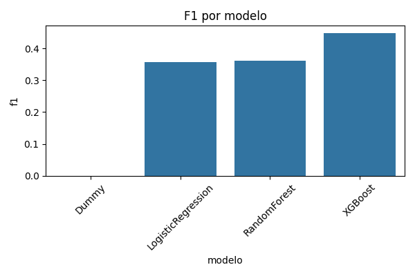
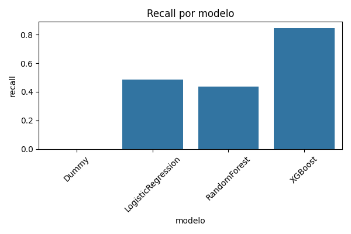
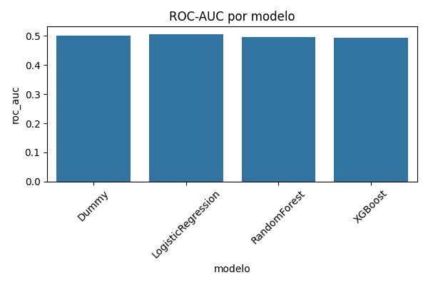

# README_exparcial_visual.md
# Evidencias Visuales – Examen Parcial  
Proyecto: Deteccion de Riesgos de Corrupcion en Obras Publicas  
Autores: Fernando Garcia – Hilario Aradiel  
Version: 1.0  
Fecha: 2025  

---

# 📊 1. Resultados de Modelos (Experimentos)

## F1 por Modelo  


## Recall por Modelo  


## ROC-AUC por Modelo  


---

# 🧪 2. Ablation Study

## F1 por Configuracion  


## Recall por Configuracion  


## ROC-AUC por Configuracion  


---

# 🧠 3. Interpretabilidad – XAI (SHAP)

## SHAP Summary Plot  


## SHAP Bar Plot  


---

# 🔍 4. EDA Profesional

## Distribucion de la variable objetivo  


### Nota  
Los histogramas NUM y barras CAT pueden visualizarse en la carpeta:  
`reports/graficos/`

---

# 📂 5. Tablas de evidencia incluídas

- resultados_modelos_parcial.csv  
- ablation_results.csv  
- importancia_variables_shap_top20.csv  
- estadisticos_descriptivos.csv  

Estan disponibles en:
```
reports/tablas/
```

---

# 📝 6. Proposito de este README  
Este documento resume todas las evidencias visuales necesarias para que el jurado revise el Examen Parcial directamente desde GitHub, sin requerir ejecucion local.

Incluye:
- Resultados comparativos de modelos  
- Estudio de ablacion  
- Interpretabilidad SHAP  
- Analisis exploratorio  
- Tablas exportadas  

---

# ✔ Listo para ser evaluado  
Todas las imagenes y tablas estan preparadas para ser visualizadas desde el repositorio.

